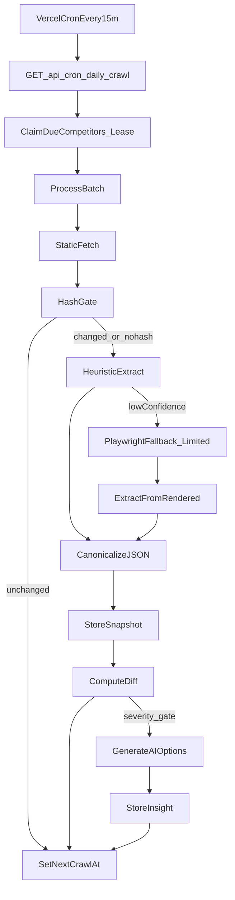

## What you decided (locked)

- **Deploy**: Vercel **Hobby**
- **Plans**:
  - Starter **$19/mo**, **3 competitors**
  - Pro **$50/mo**, **10 competitors**
- **Trial**: user clicks **Start trial** → 7 days, **Starter limits/features** only, then revoked
- **Weekly digest**: **paying customers only**
- **No proxy**
- **Your own product**: **manual plan entry** (no auto-extract)
- **Decision engine**:
  - Starter/trial: **High severity only**
  - Pro: **High + Medium** (and/or higher weekly insight cap)

## Key constraint: Vercel Hobby runtime

Vercel Hobby functions have tight runtime limits, so “daily-all” must be implemented as **many small batches**, not one big nightly job.

## Batch scheduler design (meets “daily-all”)

- Add fields to competitor companies: `nextCrawlAt`, `crawlLeaseUntil`, `lastCrawlAt`, `lastCrawlStatus`, `lastContentHash`.
- Configure Vercel Cron to hit `/api/cron/daily-crawl` **every 10–15 minutes**.
- Each invocation:
  - Claims up to **N due competitors** atomically (lease)
  - Processes them (static-first; optional 0–1 Playwright fallbacks per run)
  - Sets each competitor’s `nextCrawlAt = now + 24h` (or shorter backoff on failures)
- Result: every competitor is still crawled at least once per day, but workload is spread across the day.

## Data model changes (Mongoose)

Follow existing repo patterns: `timestamps: true`, `toJSON` plugin, use `connectMongo()`.

- `**models/User.ts**` additions (trial + email targeting):
  - `trialStartedAt?: Date`
  - `trialEndsAt?: Date`
  - `trialStatus?: 'not_started'|'active'|'expired'`
  - (optional) `lastWeeklyDigestAt?: Date`
- `**models/Company.ts**` (new):
  - `userId`, `type: 'self'|'competitor'`, `name`, `homepageUrl`, `pricingUrl`, `discoveryConfidence`
  - `nextCrawlAt`, `crawlLeaseUntil`, `lastCrawlAt`, `lastCrawlStatus`, `lastError`
  - `lastContentHash`
- `**models/Snapshot.ts**` (new):
  - `companyId`, `capturedAt`, `parsedJson`, `confidence`, `methodUsed`, `contentHash`, `rawTextRef`
  - For self: `methodUsed = 'manual'`
- `**models/Diff.ts**` (new):
  - `companyId`, `fromSnapshotId`, `toSnapshotId`, `diffJson`, `severity`, `isVerified`
- `**models/Insight.ts**` (new):
  - `diffId`, `createdAt`, `aiJson`, `model`, `costEstimate`, `thumb?: 'up'|'down'`

## Access + limits logic

Implement a single “entitlements” helper:

- **Authenticated?** via `auth()`
- **Access state**:
  - Paying: `user.hasAccess === true`
  - Trial: `trialStatus === 'active' && trialEndsAt > now`
- **Plan tier**:
  - Paying: resolve by `user.priceId` from `[config.ts](/Users/rubayet/Code/SaaS/price-tracker/config.ts)`
  - Trial: force to Starter limits regardless of Stripe
- **Limits**:
  - competitor cap: 3 or 10
  - insight generation: Starter/trial only High severity; Pro High+Medium; also add weekly cap to protect cost

## Stripe plan config updates

Update:

- `[config.ts](/Users/rubayet/Code/SaaS/price-tracker/config.ts)`: set displayed prices and rename plans to Starter/Pro; add `maxCompetitors` and (optional) `weeklyInsightCap`.
- `[types/config.ts](/Users/rubayet/Code/SaaS/price-tracker/types/config.ts)`: extend plan type to include those limits.

Webhook updates in `[app/api/webhook/stripe/route.ts](/Users/rubayet/Code/SaaS/price-tracker/app/api/webhook/stripe/route.ts)`:

- Ensure `user.priceId` updates on plan changes (handle `customer.subscription.updated`).
- Keep `user.hasAccess` aligned for paid state.

## Onboarding + UI (minimal)

Build 2 screens:

- `**/dashboard/setup**`:
  - self product info + **manual plan entry**
  - competitors: name + homepage; show discovered pricing URL candidates + override
  - show competitor count vs limit
  - “Start trial” button if no access and no active trial
- `**/dashboard**`:
  - default: “You vs competitors” comparison (always non-empty)
  - feed: verified diffs; filter default to High severity for Starter/trial
  - trust cues: last checked, confidence, blocked/manual-needed

Current dashboard is a placeholder: `[app/dashboard/page.tsx](/Users/rubayet/Code/SaaS/price-tracker/app/dashboard/page.tsx)`

## Discovery + extraction (no-proxy)

- Discovery:
  - fetch homepage → collect internal links
  - score keyword paths + validate candidates with pricing signals
  - save top candidates + confidence; require user confirmation if low confidence
- Crawl:
  - static fetch first
  - Playwright fallback only if heuristic says “needs JS” and within per-run cap
- Extraction:
  - heuristics first
  - LLM fallback only on low confidence
- Hash gate:
  - compute stable text hash; if unchanged, skip extraction/diff

## Weekly digest email (paying customers only)

Cron weekly route:

- Query users with `hasAccess === true`
- Include only verified diffs since last digest (or last 7 days)
- Send via `[libs/resend.ts](/Users/rubayet/Code/SaaS/price-tracker/libs/resend.ts)`

## Vercel Cron config

Add `vercel.json` with:

- frequent batch crawl schedule (e.g. every 10–15 minutes)
- weekly digest schedule (once weekly)
- Secure cron endpoints with `CRON_SECRET`

## Implementation todos

- **entitlements**: implement trial start button flow + entitlements helper + plan limits.
- **models**: add Company/Snapshot/Diff/Insight models.
- **setup UI**: manual self-plan entry + competitor onboarding + discovery/override.
- **batch crawler**: Vercel cron route with lease-based batch claiming + static-first crawl + limited Playwright fallback + hash gating.
- **diff + insights**: canonicalize JSON, compute low-noise diffs, gate decision engine by plan.
- **weekly digest**: paying-only digest route + vercel cron schedule.

## Remaining edge cases to explicitly support in MVP

- Pricing pages with “Custom / contact sales” instead of numbers
- Multiple pricing pages (add-ons): store multiple candidate URLs, but pick one primary for MVP
- Currency mismatch and non-USD (store currency if detected, otherwise null)
- Extraction confidence too low: store snapshot as unverified; don’t generate diffs/insights
- Bot-blocked: mark competitor blocked; require manual override; exponential backoff

